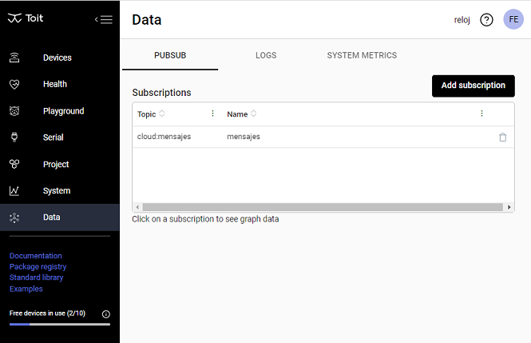
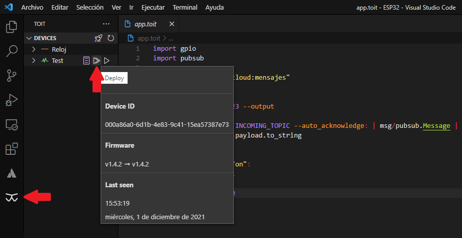

# Como encender y apagar un LED conectado a un [ESP32 de Espressif](https://www.espressif.com) de forma remota desde node.js usando PubSub y [TOIT](https://toit.io).

¿ Que necesitamos ?

- Disponer de un ESP32, un LED y una resistencia de unos 220 ohms.

- Crear una cuenta en [TOIT](https://toit.io).

- Instalar [Visual Studio Code](https://code.visualstudio.com).

- Instalar en Visual Studio Code [ésta](https://marketplace.visualstudio.com/items?itemName=toit.toit) extensión.

* Instalar el CLI (Command Line Interface), que lo podemos descargar desde [aqui](https://docs.toit.io/getstarted/installation).

* Seguir [estos](https://docs.toit.io/getstarted/quick_start) pasos para cargar el firmware TOIT en el ESP32 y aprovisionarlo en la nube. Luego de esta etapa toda la comunicación la vamos a hacer por WiFi.

Desde la [consola](https://console.toit.io/data/pubsub) de TOIT agregamos una suscripción, en mi caso le puse el nombre "mensajes".



[Aquí](https://docs.toit.io/apis/pubsub) podemos leer sobre el funcionamiento de PubSub.

También vamos a necesitar una clave de API, la creamos desde [aquí.](https://console.toit.io/project/apikeys)

Creamos una carpeta para nuestro proyecto y dentro de ella creamos 2 archivos:

- app.toit
- app.yaml

Dentro del archivo app.yaml escribimos lo siguiente:

```
name: app

entrypoint: app.toit

pubsub:
  subscriptions:
   - "cloud:mensajes"
```

Este archivo es para configurar la aplicación. Le estamos diciendo que se ejecute el código app.toit cuando reciba un mensaje en el tópico "mensajes" del PubSub. Para conocer más detalles sobre los archivos "yaml" podemos ir a [este link](https://docs.toit.io/platform/apps/appspec).

En el archivo app.toit que es nuestra aplicación que vamos a ejecutar en el ESP32 escribimos lo siguiente:

```
import gpio
import pubsub

INCOMING_TOPIC ::= "cloud:mensajes"

main:
    led := gpio.Pin 23 --output

    pubsub.subscribe INCOMING_TOPIC --auto_acknowledge: | msg/pubsub.Message |
        texto := msg.payload.to_string
        print texto

        if texto == "on":
            led.set 1
        else:
            led.set 0
```

El código es muy simple, declaramos el PIN 23 del ESP32 como salida donde debemos conectar el LED con la resistencia.
Luego nos suscribimos al tópico "cloud:mensajes" que fue el que creamos más arriba y en la variable texto vamos a obtener el texto en formato string que nos llega. Luego con un IF encendemos el LED en caso de que llegue un "on" y en el caso que sea cualquier otro texto lo apagamos.

El siguiente paso es subir el código desde la extensión TOIT que instalamos en VSCODE.

Para esto hacemos clic en la extensión (nos va a pedir hacer loguearnos) y luego seleccionamos el dispositivo y damos clic en deploy.



El próximo paso sería mandar un mensaje PubSub "on" para encender el LED.
En un principio lo podemos hacer desde el CLI de TOIT, para esto desde una terminal de VSCODE hacemos lo siguiente:

```
toit auth login   // Ejecutamos este comando para autenticarnos en TOIT. Nos va a abrir una ventana en el navegador la cual vamos a tener que aceptar.

toit pubsub write cloud:mensajes -- "on"    // Esto publica el mensaje "on" y el LED debería encender.

toit help // Este comando nos sirve para obtener ayuda sobre todos los comandos disponibles.
```

Luego si publicamos un mensaje con otro texto distinto a "on" el LED debería apagarse.

Si tenemos varios ESP32 y queremos mandarle un mensaje a uno en particular lo podemos hacer de la siguiente manera:

```
toit pubsub write cloud:<topic-name>?device-id=<id> <name> -- <write a message>
```

## Ahora viene lo interesante.

TOIT proporciona una [API gRPC](https://github.com/toitware/api) para que desde otros lenguajes de programación podamos ejecutar los comandos de la consola TOIT.

El servicio está disponible en esta URL: http//api.toit.io y para acceder necesitamos la clave de API que creamos más arriba.

Este ejemplo lo voy a hacer con node.js así que tenemos que tener instalado node.js en nuestra computadora.

En el archivo index.js en la línea 10 debemos escribir nuestra clave de API.

Y en el segundo parámetro de la línea 45 debemos escribir el mensaje que queremos enviar, en nuestro caso puede ser "on" u "off".

```
main("cloud:mensajes", "on");
```

Antes de ejecutar el código debemos descargar las dependencias, esto lo hacemos una sola vez con el siguiente comando:

```
npm install
```

Luego desde una terminal de VSCODE ejecutamos lo siguiente:

```
node index
```

Ahora ya podemos controlar de forma remota nuestro ESP32, lo que nos puede servir en una infinidad de proyectos de IOT.
